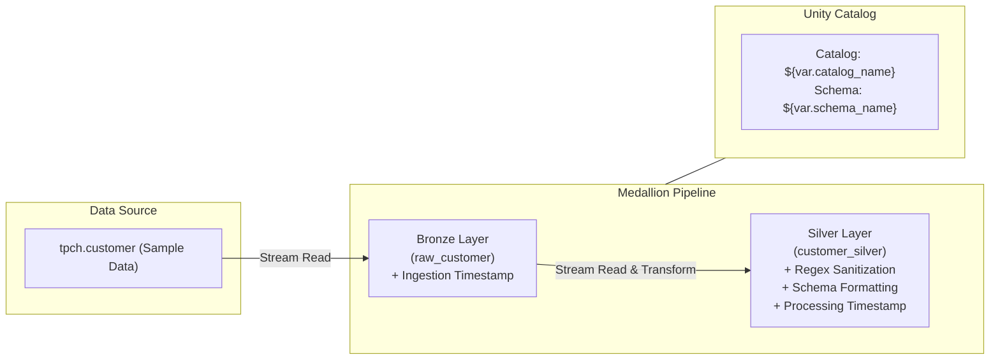

# Databricks Asset Bundle (DAB) - Customer Data Pipeline
[](https://docs.databricks.com/en/dev-tools/bundles/index.html)
[](https://spark.apache.org/)
[](https://github.com/features/actions)
[](LICENSE)
An enterprise-ready **Databricks Asset Bundle (DAB)** template demonstrating production data pipeline orchestration using **Delta Live Tables (DLT)**, **PySpark Pipelines**, **Unity Catalog**, and automated **CI/CD with GitHub Actions**.
---
## 📋 Table of Contents
- [Overview](#-overview)
- [Architecture](#-architecture)
- [Project Structure](#-project-structure)
- [Key Features](#-key-features)
- [Prerequisites](#-prerequisites)
- [Environment Configuration](#-environment-configuration)
- [Getting Started](#-getting-started)
- [CI/CD Pipeline](#-cicd-pipeline)
- [License](#-license)
---
## 🌟 Overview
This repository provides a modular, declarative structure for managing data engineering workloads on Databricks. Utilizing **Databricks Asset Bundles (DABs)**, infrastructure and code are treated as unified software artifacts—enabling seamless deployment across Development, QA, and Production environments.
---
## 🏗️ Architecture
The pipeline implements a streaming **Medallion Architecture** using PySpark Delta Live Tables:


## 🚀 Getting Started
### 1. Clone the Repository
```bash
git clone https://github.com/hridoy1335/databricks_asset_bundle.git
cd databricks_asset_bundle
```
### 2. Authenticate Databricks CLI
Authenticate with your Databricks target workspace:
```bash
databricks configure --host https://<your-databricks-workspace-instance>
```
### 3. Validate the Bundle Configuration
Verify the DAB configuration files for your target environment (`dev` or `qa`):
```bash
# Validate development environment
databricks bundle validate -t dev
# Validate QA environment
databricks bundle validate -t qa
```
### 4. Deploy to Databricks Workspace
Deploy assets to your workspace root directory:
```bash
# Deploy to Development
databricks bundle deploy -t dev
```
### 5. Run the Pipeline Job
Trigger the deployed job pipeline:
```bash
databricks bundle run dab_job -t dev
```
---
## 🔄 CI/CD Pipeline
Automated continuous integration and deployment are configured using **GitHub Actions** (`.github/workflows/main.yml`).
### Workflow Steps:
1. **Validate**: Automatically runs `databricks bundle validate -t qa` on pull requests or commits to `main`.
2. **Deploy QA**: Executes `databricks bundle deploy -t qa` upon validation success.
### Required GitHub Secrets:
To enable CI/CD deployment, configure the following repository secrets under **Settings ➔ Secrets and variables ➔ Actions**:
- `DATABRICKS_HOST_QA`: Databricks instance URL for QA workspace.
- `DATABRICKS_TOKEN_QA`: Personal Access Token (PAT) or Service Principal Token for QA workspace.
- *(Optional)* `DATABRICKS_HOST_PROD` & `DATABRICKS_TOKEN_PROD` for production deployments.
---
## 📜 License
This project is licensed under the [MIT License](LICENSE).
